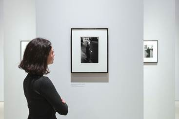

Junkai Man

Final project proposal

MEDIART-206

Prof. Benjamin Bacon

----

​        In the final project, I plan to design a device that applies face tracking technology into art exhibition.

​        It’s a common scene that audiences at art gallery will usually gaze at artwork for a long time to observe the details and feel the in-depth meanings behind the works. This “gazing” and long-time observation is necessary if we want to truly understand an artwork and feel the same as the authors. So I intend to design a device that detects and analyzes whether there is an audience looking at the screen, how many audiences are looking at the screen, and whether audiences are focusing on the screen. If there’s no one looking at the screen, the graphic will be black. If an audience stops his/her foot and starts looking at the screen, the content will gradually show up. The algorithm will analyze the expression on the audience’s face and determine whether he/she is “gazing” and ruminating. If the audience is paying attention to this artwork, the graphic on the screen will become clearer and more variations will appear. Besides, the algorithm will analyze how many faces are appeared in front of the screen. The more audiences appear at the same time, the more exaggerated the graphic and more variations there will be.

Copyright: © Mark Blower 2019

​        I got inspired by a short story that happened to me last month. Last month during the 2020 Fall DKU Innovation Summit, by chance I had lunch with the artist Qian Zhou who is the donor of the painting “The glow of life” in DKU. This painting is now hanging on the wall right-hand side when entering the front door of the Academic Building in DKU. After lunch, she led me to the painting and asked me what I could see from it. The painting is quite abstract with different kinds of colorful splashes and it was hard for me to describe at first glance. However, after a short period of time of observation, I found quite a lot of “hidden” elements behind the artwork such as mountain shapes, trees, human shapes, and even some abstract Chinese characters. But I’ve never noticed these details before because I haven’t observed and gazed at this artwork for long even though I know it’s been hanging on the wall in AB for years. And this experience triggered me to think that there will be more details like this in every artwork but we just don’t pay enough attention to them. As long as we spend some time “gazing” and ruminating on something, we will discover new aspects behind what we think they used to be. There will always be many “details” undiscovered and they deserve our attention and our “gazing”.

​        I plan to fulfill these expectations with the help of ofxFaceTracker. This addon provides many powerful features such as face detection, face landmark detection, and pose estimation. It is dependent on OpenCV and OSC protocol. The parameters, for example, face orientation, mouth width & height, eye height & openness, jaw openness will be automatically calculated and transferred via OSC. What I need to program for this project is the algorithm that analyzes audiences’ attention on the screen, how many audiences are there, and the display of the actual “artwork”.

​        To be clearer and more specific about the features, I will use this function list to show them in order. It can also help me organize my thoughts when programming.

- The artwork appears only if you are gazing at it. And it appears with a gradual transition from black to normal.
- The artwork will turn black if you are not looking at it.
- The longer you gaze, the more variations will appear on the artwork.
- Use pose estimation to change the 3d view relative to the audience head’s position and orientation.
- Analyze the audience’s concentration according to audience’s expression (eye openness, still time, etc.), and give corresponding variations on the graphic.
- When there are more faces detected, more exaggerated the graphic will be, and more variations will appear on the screen.